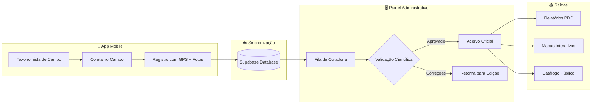
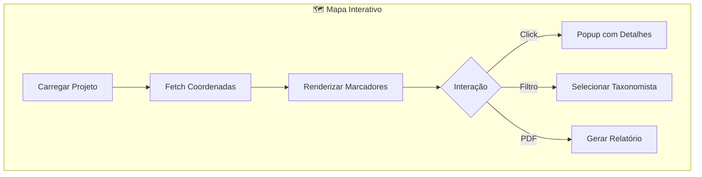
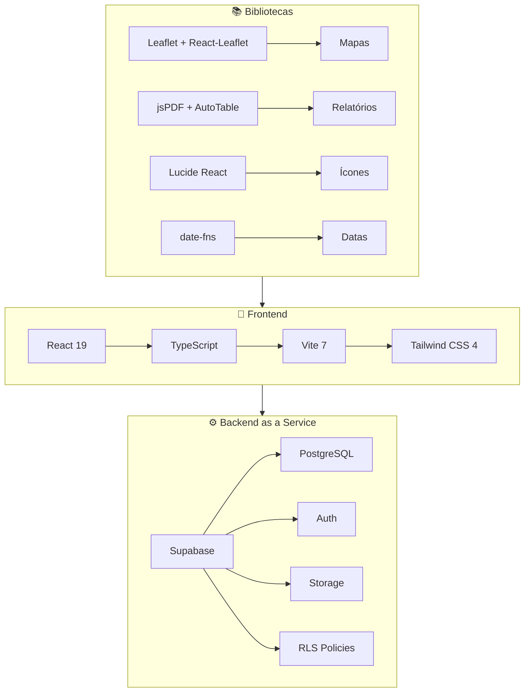
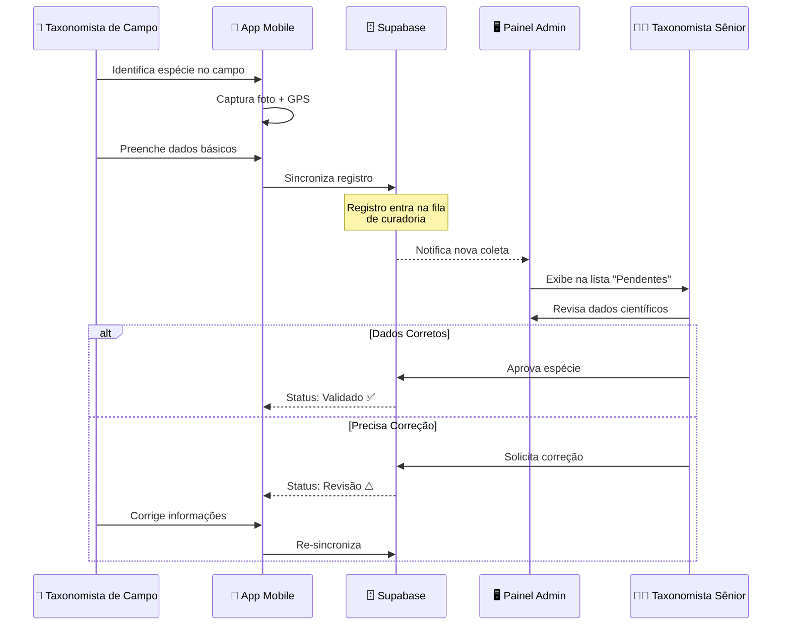
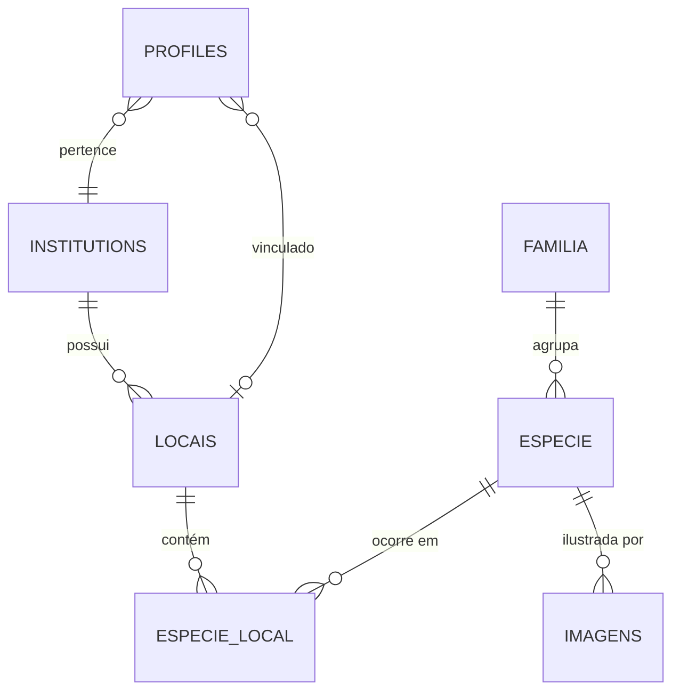

# 📊 Documentação Técnica e Funcional
## Painel Administrativo Veridia Saber

> **Versão:** 1.0  
> **Data:** 21 de Janeiro de 2026  
> **Objetivo:** Apresentação para a Diretoria do Jardim Botânico

---

## 1. Visão Geral do Painel

### 1.1 Propósito do Sistema

O **Painel Administrativo Veridia Saber** é a central de comando digital do acervo botânico. Ele foi projetado para garantir ao Jardim Botânico **domínio total** sobre seu patrimônio científico, oferecendo:

| Pilar | Descrição |
|-------|-----------|
| **🎯 Gestão Centralizada** | Único ponto de controle para todas as espécies, famílias botânicas, projetos e pesquisadores |
| **✍️ Curadoria de Dados** | Validação científica dos registros coletados em campo através do aplicativo móvel |
| **📈 Monitoramento em Tempo Real** | Dashboards e estatísticas atualizadas sobre o crescimento do acervo |

### 1.2 Fluxo de Controle e Organização



---

## 2. Ferramentas de Gestão (Funcionalidades)

### 2.1 CRUD de Plantas/Espécies

O sistema oferece gerenciamento completo do catálogo de espécies através de uma interface intuitiva.

#### Funcionalidades Disponíveis

| Ação | Descrição | Níveis com Acesso |
|------|-----------|-------------------|
| **Criar** | Cadastramento de novas espécies com dados taxonômicos completos | Curador Mestre → Taxonomista de Campo |
| **Visualizar** | Consulta detalhada de todas as informações da espécie | Todos os níveis |
| **Editar** | Atualização de dados científicos, nomes populares, cuidados | Curador Mestre → Taxonomista de Campo |
| **Excluir** | Remoção de registros (com confirmação dupla) | Curador Mestre, Coordenador |

#### Dados Gerenciados por Espécie

- **Taxonomia**: Nome científico, autor, família botânica
- **Identificação**: Nome popular, descrição da espécie
- **Cuidados de Cultivo**: Luz, temperatura, água, nutrientes, substrato
- **Localização**: Projeto vinculado, coordenadas GPS
- **Mídia**: Galeria de fotos com créditos e atribuições

#### Geração de Relatórios PDF

O painel permite gerar fichas técnicas profissionais contendo:
- Dados dendrométricos (DAP, altura, copa)
- Informações taxonômicas completas
- Status fitossanitário
- Valoração e biomassa
- Foto de capa da espécie

---

### 2.2 Visualização de Dados no Mapa Web

O módulo de mapas oferece visualização georreferenciada de todo o acervo coletado.

#### Tipos de Mapas

| Mapa | Propósito | Funcionalidades |
|------|-----------|-----------------|
| **Mapa do Projeto** | Visualização por projeto/local específico | Filtro por taxonomista, marcadores coloridos (próprios x outros) |
| **Mapa Global** | Visão geral de todas as coletas | Agregação por densidade, zoom adaptativo |

#### Recursos Visuais

- **Marcadores Inteligentes**: Círculos verdes para espécies validadas, laranja para coletas do usuário logado
- **Popup Informativo**: Nome científico, família, foto, responsável pela coleta
- **Exportação**: Geração de relatório PDF diretamente do mapa
- **Tiles Modernos**: Camadas CartoDB Voyager para visualização limpa e profissional



---

### 2.3 Gestão de Usuários/Pesquisadores

O sistema implementa um modelo hierárquico de **6 níveis de acesso** baseado em funções (RBAC).

#### Hierarquia de Cargos

| Nível | Cargo | Escopo | Permissões Principais |
|:-----:|-------|--------|----------------------|
| 1 | **Curador Mestre** | Global | Acesso total, gerencia todos os projetos e usuários |
| 2 | **Coordenador Científico** | Global | Supervisão científica, validação de espécies |
| 3 | **Taxonomista Sênior** | Global | Curadoria de espécies, revisão de coletas |
| 4 | **Gestor de Acervo** | Local | Gerencia dados do projeto vinculado |
| 5 | **Taxonomista de Campo** | Local | Coleta e cadastro de espécies em campo |
| 6 | **Consulente** | Local | Apenas visualização do acervo |

#### Regras de Governança

> [!IMPORTANT]
> **Princípio de Hierarquia**: Um usuário só pode gerenciar usuários de nível inferior ao seu.

- Usuários **Globais** (Níveis 1-3) têm acesso a todos os projetos
- Usuários **Locais** (Níveis 4-6) só visualizam dados do projeto atribuído
- O campo `local_id` no perfil vincula o pesquisador ao seu projeto

#### Funcionalidades de Gestão

- **Cadastro de Usuários**: Criação de novos pesquisadores com atribuição de cargo
- **Edição de Perfil**: Atualização de dados e alteração de nível de acesso
- **Vinculação a Projeto**: Associação de pesquisadores a projetos específicos
- **Exclusão Segura**: Remoção de usuários com confirmação e auditoria

---

### 2.4 Relatórios e Dashboards

O painel oferece visões personalizadas conforme o nível de acesso do usuário.

#### Dashboards por Perfil

| Perfil | Componente | Métricas Exibidas |
|--------|------------|-------------------|
| **Admin Global** | `GlobalAdminView` | Total de espécies, famílias, projetos, usuários, logs recentes |
| **Admin Local** | `LocalAdminView` | Estatísticas do projeto, espécies recentes, famílias locais |
| **Taxonomista Sênior** | `SeniorView` | Trabalhos recentes, espécies pendentes de curadoria, nova família |
| **Taxonomista de Campo** | `FieldTaxonomistView` | Trabalhos do dia, metas, espécies catalogadas |
| **Consulente** | `CatalogerView` | Estatísticas gerais em modo somente leitura |

#### Modal de Analytics (Administradores)

Usuários com níveis 1-2 têm acesso ao painel de analytics que exibe:
- Usuários ativos hoje
- Eventos de sincronização
- Tendências de uso do aplicativo móvel
- Métricas de engajamento

#### Índices de Biodiversidade

O sistema calcula e exibe automaticamente:
- **Índice de Shannon** (diversidade)
- **Riqueza de Espécies** (quantidade única)
- **Total de Árvores/Registros**

---

## 3. Tecnologia e Segurança

### 3.1 Stack Tecnológica



#### Detalhamento da Stack

| Categoria | Tecnologia | Versão | Propósito |
|-----------|------------|--------|-----------|
| **Core** | React | 19.2 | Biblioteca de UI |
| **Linguagem** | TypeScript | 5.9 | Tipagem estática |
| **Build** | Vite | 7.2 | Empacotador e servidor de desenvolvimento |
| **Estilização** | Tailwind CSS | 4.1 | Framework CSS utilitário |
| **Backend** | Supabase | 2.89 | Autenticação, banco de dados, storage |
| **Mapas** | Leaflet | 1.9 | Visualização geoespacial |
| **PDF** | jsPDF + AutoTable | 3.0 / 5.0 | Geração de relatórios |
| **Roteamento** | React Router DOM | 7.11 | Navegação SPA |
| **PWA** | Vite Plugin PWA | 1.2 | Progressive Web App |

---

### 3.2 Proteção de Dados

#### Autenticação

O sistema utiliza **Supabase Auth** para gerenciamento seguro de sessões:

- **Login via E-mail/Senha**: Autenticação tradicional com hash bcrypt
- **Magic Link** (opcional): Acesso sem senha via link enviado por e-mail
- **Recuperação de Senha**: Fluxo seguro com tokens de uso único
- **Sessões Persistentes**: JWT armazenado de forma segura

#### Row Level Security (RLS)

> [!CAUTION]
> Todas as tabelas críticas possuem políticas RLS que **impedem acesso não autorizado** mesmo em caso de tentativa de exploração direta ao banco.

**Exemplo de Política RLS para Espécies:**
```sql
-- Usuários só podem ver espécies do seu projeto ou globais
CREATE POLICY "species_visibility" ON especie
FOR SELECT
USING (
    local_id IS NULL  -- Espécies globais
    OR local_id = auth.jwt() ->> 'local_id'  -- Mesmo projeto
    OR EXISTS (  -- Admin global
        SELECT 1 FROM profiles 
        WHERE id = auth.uid() 
        AND role IN ('Curador Mestre', 'Coordenador Científico')
    )
);
```

#### Auditoria

O sistema registra automaticamente todas as ações críticas na tabela `audit_logs`:

| Campo | Descrição |
|-------|-----------|
| `user_id` | Quem executou a ação |
| `action_type` | CREATE, UPDATE, DELETE |
| `table_name` | Tabela afetada |
| `old_data` / `new_data` | Estado antes e depois (JSONB) |
| `created_at` | Timestamp da ação |

---

### 3.3 Controle de Acesso

#### Matriz de Permissões por Funcionalidade

| Funcionalidade | CM | CC | TS | GA | TC | CO |
|----------------|:--:|:--:|:--:|:--:|:--:|:--:|
| Gerenciar Usuários | ✅ | ✅ | ❌ | ❌ | ❌ | ❌ |
| Excluir Espécies | ✅ | ✅ | ❌ | ❌ | ❌ | ❌ |
| Criar Espécies | ✅ | ✅ | ✅ | ✅ | ✅ | ❌ |
| Editar Espécies | ✅ | ✅ | ✅ | ✅ | ✅ | ❌ |
| Visualizar Mapa | ✅ | ✅ | ✅ | ✅ | ✅ | ✅ |
| Analytics | ✅ | ✅ | ❌ | ❌ | ❌ | ❌ |
| Gerar PDFs | ✅ | ✅ | ✅ | ✅ | ✅ | ✅ |

**Legenda**: CM=Curador Mestre, CC=Coordenador, TS=Tax. Sênior, GA=Gestor, TC=Tax. Campo, CO=Consulente

---

## 4. Fluxo de Trabalho

### 4.1 Da Coleta à Validação

O fluxo completo desde a coleta em campo até a publicação no acervo oficial segue as etapas:



### 4.2 Etapas Detalhadas

#### 1️⃣ Coleta em Campo (App Mobile)

O Taxonomista de Campo utiliza o aplicativo móvel para:
- Fotografar a espécie (múltiplos ângulos)
- Capturar coordenadas GPS automaticamente
- Preencher nome científico (sugestões autocomplete)
- Selecionar família botânica
- Adicionar anotações de campo

#### 2️⃣ Sincronização

Quando o dispositivo tem conexão:
- Dados são enviados para o Supabase
- Fotos são armazenadas no Storage
- Registro entra na tabela `plantas_da_colecao` ou `especie_local`

#### 3️⃣ Curadoria no Painel

Taxonomistas Sênior e Coordenadores acessam o painel para:
- Verificar nomenclatura científica
- Confirmar família botânica
- Validar geolocalização no mapa
- Aprovar ou solicitar correções

#### 4️⃣ Publicação no Acervo

Após validação:
- Espécie é movida para o acervo oficial (`especie`)
- Dados ficam disponíveis para consulta pública
- Relatórios PDF podem ser gerados
- Espécie aparece nos mapas institucionais

---

## 5. Estrutura do Banco de Dados

### 5.1 Tabelas Principais

O sistema utiliza **21+ tabelas** organizadas por domínio:

| Domínio | Tabelas | Propósito |
|---------|---------|-----------|
| **Taxonomia** | `especie`, `familia`, `especie_local` | Dados científicos |
| **Geografia** | `locais`, `estados`, `municipios` | Localização |
| **Usuários** | `profiles`, `institutions` | Perfis e organizações |
| **Coletas** | `plantas_da_colecao`, `colecoes` | Registros de campo |
| **Mídia** | `imagens`, `colecao_imagens` | Fotografias |
| **Auditoria** | `audit_logs`, `admin_notifications` | Rastreabilidade |

### 5.2 Relacionamentos Chave



---

## 6. Conclusão

O **Painel Administrativo Veridia Saber** oferece ao Jardim Botânico uma plataforma robusta e segura para:

> [!TIP]
> **Benefícios Imediatos**
> - ✅ Centralização de todo o acervo botânico digital
> - ✅ Controle hierárquico de acesso baseado em funções
> - ✅ Rastreabilidade completa de todas as alterações
> - ✅ Geração de relatórios profissionais para publicações
> - ✅ Visualização geográfica das coletas

O sistema garante que o Jardim Botânico mantenha **domínio total** sobre seu patrimônio científico, com processos claros de curadoria e governança de dados.

---

> **Desenvolvido por:** [Jayan de Moura Souza](https://www.linkedin.com/in/jayan-de-moura-801129137)  
> **Plataforma:** Veridia Saber © 2024-2026  
> **Processo INPI:** 942168313
